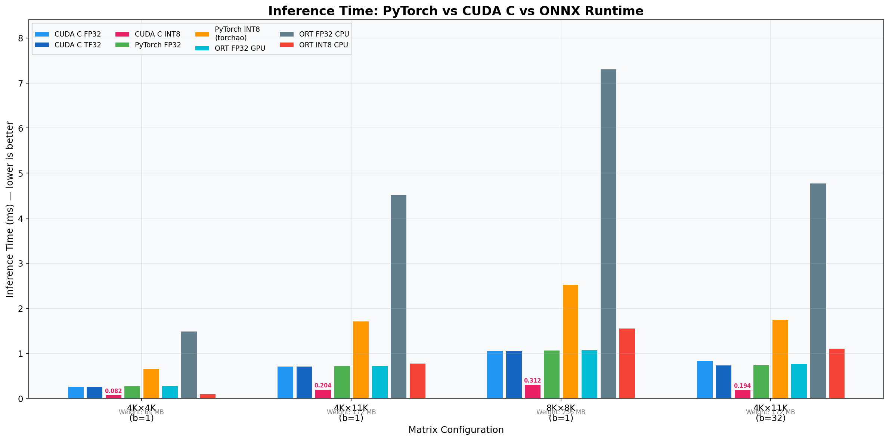
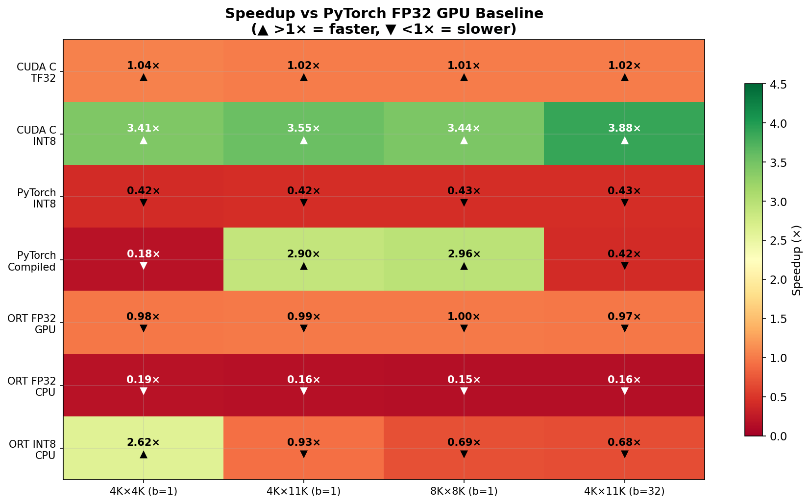
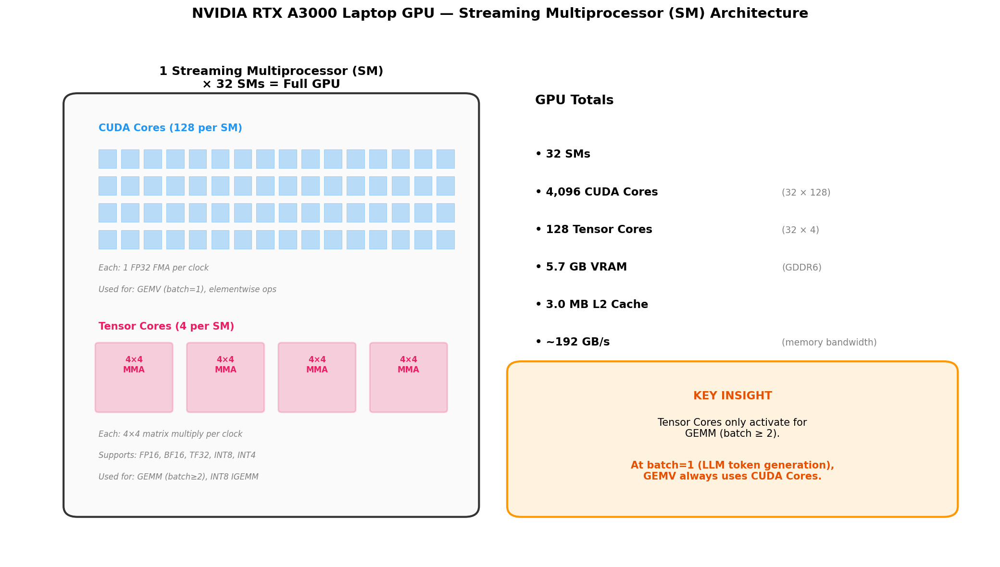
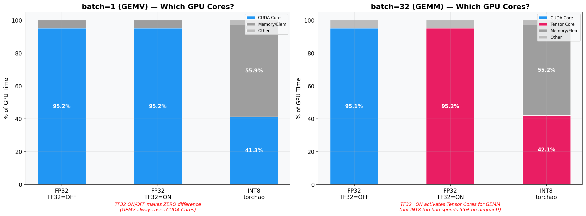
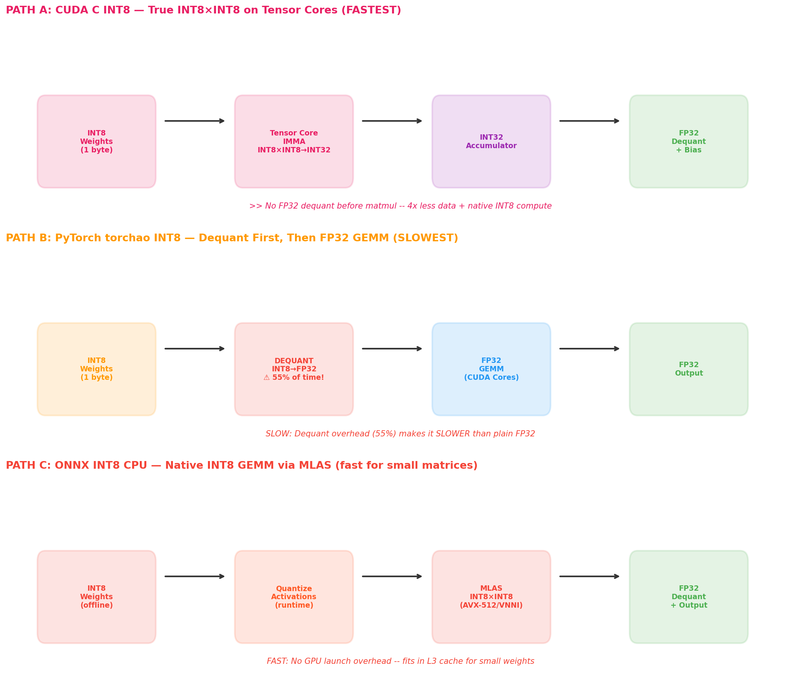
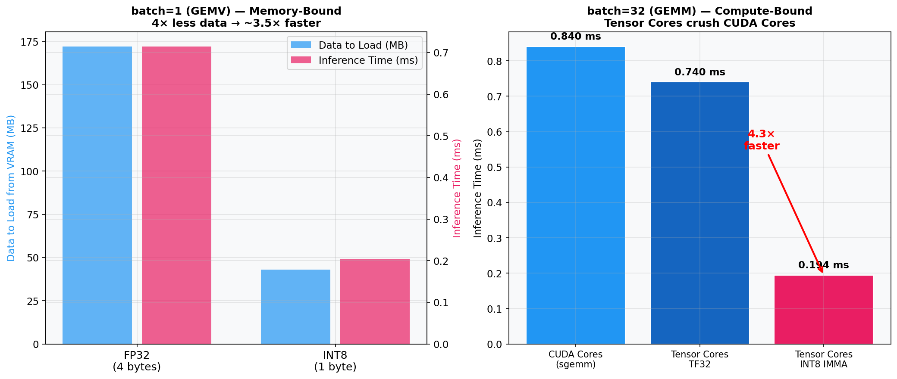
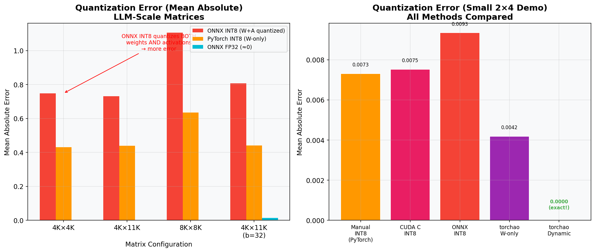
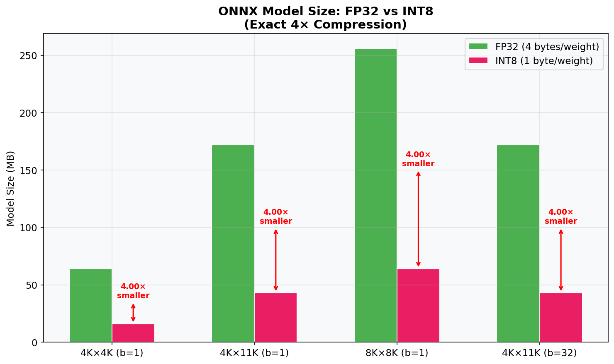

# FP32 → INT8 Quantization: A Complete Visual Guide

## PyTorch vs CUDA C vs ONNX Runtime — What Happens Inside Your GPU

---

## Table of Contents

1. [What Is Quantization?](#1-what-is-quantization)
2. [The Experiment](#2-the-experiment)
3. [Results: Who Wins?](#3-results-who-wins)
4. [Which GPU Cores Are Used?](#4-which-gpu-cores-are-used)
5. [Why Is CUDA C INT8 the Fastest?](#5-why-is-cuda-c-int8-the-fastest)
6. [Why Is PyTorch INT8 SLOWER Than FP32?](#6-why-is-pytorch-int8-slower-than-fp32)
7. [Why Does ONNX INT8 on CPU Beat GPU?](#7-why-does-onnx-int8-on-cpu-beat-gpu)
8. [The TF32 Mystery: Why ON/OFF Makes No Difference at batch=1](#8-the-tf32-mystery)
9. [Quantization Error: How Much Accuracy Do You Lose?](#9-quantization-error)
10. [Model Size: The 4× Compression](#10-model-size)
11. [Inside the GPU: How It Actually Works](#11-inside-the-gpu)
12. [When Should You Use What?](#12-when-should-you-use-what)
13. [Key Takeaways](#13-key-takeaways)

---

## 1. What Is Quantization?

**The simple version:** Quantization means using smaller numbers to represent your model's weights.

Imagine you have a ruler marked in millimeters (FP32 — very precise, 4 bytes per number). Quantization replaces it with a ruler marked in centimeters (INT8 — less precise, 1 byte per number). You lose some precision, but:

- **4× less memory** — your model is 4× smaller
- **4× less data to move** — the GPU spends less time loading weights from memory
- **Potentially faster compute** — some hardware can multiply small numbers faster

```
FP32 (32-bit float):     1.23456789...  →  4 bytes per weight
                          ↓ quantize
INT8 (8-bit integer):    42              →  1 byte per weight
                          ↓ dequantize
FP32 (reconstructed):   1.23000000...   →  close but not exact
```

### The Math

```
Symmetric Quantization:
  scale = max(|all_weights|) / 127
  int8_value = round(float_value / scale)         ← compress
  float_reconstructed = int8_value × scale         ← decompress

Example:
  weights = [0.5, -1.2, 0.8, -0.3]
  max(|weights|) = 1.2
  scale = 1.2 / 127 = 0.00945
  int8 = round([0.5, -1.2, 0.8, -0.3] / 0.00945) = [53, -127, 85, -32]
```

The error comes from rounding — you can only represent 255 distinct values (-127 to +127) instead of billions.

---

## 2. The Experiment

### Hardware

```
NVIDIA RTX A3000 Laptop GPU (Ampere architecture)
├── 32 Streaming Multiprocessors (SMs)
│   ├── 4,096 CUDA Cores (general-purpose math)
│   └── 128 Tensor Cores (specialized matrix multiply)
├── 5.7 GB VRAM
├── 3.0 MB L2 Cache
└── ~192 GB/s memory bandwidth
```

### What We Tested

We ran the same matrix multiplication (simulating an LLM linear layer) across **3 runtimes** and **8 configurations**:

| Runtime | Configuration | What It Does |
|---------|--------------|-------------|
| **CUDA C** | FP32 (TF32=OFF) | Raw cuBLAS SGEMM on CUDA Cores |
| **CUDA C** | FP32 (TF32=ON) | cuBLAS SGEMM routed through Tensor Cores |
| **CUDA C** | INT8 IGEMM | cuBLASLt true INT8×INT8→INT32 on Tensor Cores |
| **PyTorch** | FP32 | nn.Linear with default settings |
| **PyTorch** | INT8 torchao | Weight-only INT8 quantization (dequant at runtime) |
| **ONNX RT** | FP32 GPU | CUDAExecutionProvider (cuBLAS under the hood) |
| **ONNX RT** | FP32 CPU | CPUExecutionProvider (MLAS library) |
| **ONNX RT** | INT8 CPU | Dynamic quantization (native INT8 GEMM via MLAS) |

### Matrix Sizes (Simulating LLM Layers)

| Config | Batch | Size | Weight | Like Which LLM Layer? |
|--------|-------|------|--------|----------------------|
| Small | 1 | 4096×4096 | 64 MB | GPT-2 attention projection |
| Medium | 1 | 4096×11008 | 172 MB | LLaMA-7B FFN layer |
| Large | 1 | 8192×8192 | 256 MB | LLaMA-13B+ layers |
| Batched | 32 | 4096×11008 | 172 MB | 32 tokens processed together |

**batch=1** simulates LLM single-token generation (the slow part of chat).
**batch=32** simulates batch processing or prefill.

---

## 3. Results: Who Wins?



### The Numbers

| Config | CUDA C INT8 | CUDA C FP32 | PyTorch FP32 | ORT INT8 CPU | PyTorch INT8 |
|--------|:----------:|:----------:|:-----------:|:----------:|:-----------:|
| 4K×4K (b=1) | **0.082 ms** | 0.270 ms | 0.280 ms | 0.107 ms | 0.668 ms |
| 4K×11K (b=1) | **0.204 ms** | 0.714 ms | 0.725 ms | 0.783 ms | 1.713 ms |
| 8K×8K (b=1) | **0.312 ms** | 1.061 ms | 1.074 ms | 1.560 ms | 2.524 ms |
| 4K×11K (b=32) | **0.194 ms** | 0.840 ms | 0.752 ms | 1.114 ms | 1.751 ms |

**CUDA C INT8 wins every single benchmark by 3-4×.**

But look at the surprise: **PyTorch INT8 is the SLOWEST** — even slower than plain FP32! And **ONNX INT8 on CPU beats PyTorch FP32 on GPU** for small matrices!



---

## 4. Which GPU Cores Are Used?

Your GPU has two types of compute units. Think of them like this:

- **CUDA Cores** = general-purpose workers. Can do any math, one operation at a time.
- **Tensor Cores** = specialized assembly line. Can only do matrix multiply, but does a 4×4 block in one shot.



### The Profiler Results

We used `torch.profiler` to see exactly which CUDA kernels run and which cores they use:



**Actual kernel names from the profiler:**

| Operation | Kernel Name | Core Type |
|-----------|------------|-----------|
| FP32 GEMV (batch=1) | `internal::gemvx::kernel` | CUDA Cores |
| FP32 GEMM TF32=OFF (batch=32) | `ampere_sgemm_64x32_sliced1x4_tn` | CUDA Cores |
| FP32 GEMM TF32=ON (batch=32) | `cutlass_80_tensorop_s1688gemm` | **Tensor Cores** |
| INT8 torchao dequant | `unrolled_elementwise_kernel` | CUDA Cores |
| INT8 torchao GEMM (batch=32) | `cutlass_80_tensorop_s1688gemm` | **Tensor Cores** |
| CUDA C INT8 IGEMM | `imma` / `s8_tensorop` | **Tensor Cores** |

---

## 5. Why Is CUDA C INT8 the Fastest?



**The answer is simple: CUDA C does true INT8 math. PyTorch doesn't.**

CUDA C uses `cuBLASLt` to call the `cublasLtMatmul` function with `CUBLAS_COMPUTE_32I`. This tells the GPU: "my inputs are INT8, multiply them as integers, accumulate in INT32." The Tensor Cores have a dedicated instruction for this called **IMMA** (Integer Matrix Multiply Accumulate) that processes INT8 data natively.

PyTorch's torchao `Int8WeightOnlyConfig()` does something very different: it stores the weights as INT8 to save memory, but at inference time it **converts them back to FP32** before doing the actual multiply. It's like compressing a file to save disk space but decompressing it every time you open it.

```
CUDA C INT8 pipeline:
  Read INT8 weights (1 byte each)  →  INT8 × INT8 multiply  →  INT32 result  →  FP32 dequant
  ─────────────────────────────────────────────────────────────────────────────────────────────
  Cost: 1 byte read + 1 native multiply per weight

PyTorch torchao pipeline:
  Read INT8 weights (1 byte each)  →  Convert to FP32 (4 bytes)  →  FP32 × FP32 multiply  →  FP32 result
  ────────────────────────────────────────────────────────────────────────────────────────────────────────
  Cost: 1 byte read + 1 conversion + 1 FP32 multiply per weight
  The conversion step takes 55% of total GPU time!
```

### The Numbers

| Metric | CUDA C INT8 | PyTorch INT8 torchao |
|--------|:-----------:|:-------------------:|
| 4K×11K (b=1) | 0.204 ms | 1.713 ms |
| Speedup vs FP32 | **3.5×** | **0.42× (slower!)** |
| Core used for matmul | Tensor Core (IMMA) | CUDA Cores (dequant) + varies |
| Dequant overhead | 0% | 55% of GPU time |

---

## 6. Why Is PyTorch INT8 SLOWER Than FP32?

This is the most counterintuitive result. You'd expect INT8 to be faster — smaller numbers, less data. But:

```
PyTorch FP32:                      PyTorch INT8 (torchao weight-only):
┌─────────────┐                    ┌─────────────┐
│ Read FP32   │  172 MB            │ Read INT8   │  43 MB (4× less! ✓)
│ weights     │                    │ weights     │
└──────┬──────┘                    └──────┬──────┘
       │                                  │
       ▼                                  ▼
┌─────────────┐                    ┌─────────────┐
│ FP32 GEMM   │  one step          │ Dequantize  │  ← THIS IS THE PROBLEM
│             │                    │ INT8 → FP32 │  55% of total GPU time!
└──────┬──────┘                    └──────┬──────┘
       │                                  │
       ▼                                  ▼
┌─────────────┐                    ┌─────────────┐
│ FP32 output │                    │ FP32 GEMM   │  same speed as left
└─────────────┘                    └──────┬──────┘
                                          │
                                          ▼
                                   ┌─────────────┐
                                   │ FP32 output │
                                   └─────────────┘

Time: 0.725 ms                     Time: 1.713 ms (2.4× SLOWER)
```

**The profiler proves it.** In the INT8 torchao session, the `unrolled_elementwise_kernel` (the dequantize step) takes **55.9%** of GPU time at batch=1. The actual matrix multiply (`gemvx`) takes only 41.3%.

**So why does torchao exist?** It's a **memory optimization**, not a speed optimization. If your LLM has 70 billion parameters at FP32, that's 280 GB — it won't fit in any single GPU. At INT8, it's 70 GB — fits in one A100 (80 GB). You trade speed for the ability to run the model at all.

---

## 7. Why Does ONNX INT8 on CPU Beat GPU?

At the smallest matrix size (4K×4K), ONNX INT8 on CPU takes **0.107 ms** while PyTorch FP32 on GPU takes **0.280 ms**. The CPU is 2.6× faster! Why?

**Three reasons:**

### Reason 1: Native INT8 on CPU

ONNX Runtime uses **MLAS** (Microsoft Linear Algebra Subroutine library) which has hand-tuned assembly for Intel's **VNNI** (Vector Neural Network Instructions). These are dedicated CPU instructions that do INT8×INT8→INT32 multiply-accumulate natively — similar to what Tensor Cores do on the GPU.

### Reason 2: No GPU Launch Overhead

Every GPU operation has a fixed cost:
```
CPU work:  prepare data → launch kernel → wait for GPU → get result
Fixed overhead: ~5-15 microseconds per kernel launch

For a tiny 0.082 ms kernel, 15 µs of overhead is significant (18%!)
CPU just... runs. No launch, no transfer, no synchronization.
```

### Reason 3: L3 Cache

The INT8 weight matrix for 4K×4K is **16 MB**. A modern CPU has a 12-30 MB L3 cache. The entire weight matrix fits in cache, making the operation **compute-bound on CPU** (limited by math speed, not memory speed).

On the GPU, even the L2 cache (3.0 MB) can't hold the weight. It must be streamed from VRAM, making it **memory-bound** (limited by memory bandwidth).

```
Matrix Size vs Cache:
                                  L3 Cache         GPU L2
                                  ┌────────┐        ┌───┐
  INT8 4K×4K  = 16 MB  ──────── │ FITS!  │        │ ✗ │
                                  └────────┘        └───┘
  INT8 8K×8K  = 64 MB  ──────── │  NOPE  │        │ ✗ │
                                  └────────┘        └───┘

At 8K×8K (64 MB): ORT INT8 CPU = 1.560 ms > PT FP32 GPU = 1.074 ms
The advantage VANISHES when the weight exceeds L3 cache.
```



---

## 8. The TF32 Mystery

**Why does TF32 ON/OFF make ZERO difference at batch=1?**

TF32 is a "cheat code" that routes FP32 operations through Tensor Cores using reduced precision (10-bit mantissa instead of 23-bit). But it ONLY works for **GEMM** (matrix × matrix), not for **GEMV** (matrix × vector).

```
batch=1:  input is [1, 4096]  ←  this is a VECTOR
          weight is [11008, 4096]
          output is [1, 11008]

          cuBLAS sees: "one row × matrix = vector"
          cuBLAS decides: "use GEMV kernel (gemvx)"
          GEMV has NO Tensor Core path → CUDA Cores only
          TF32 ON/OFF is completely ignored

batch=32: input is [32, 4096]  ← this is a MATRIX
          weight is [11008, 4096]
          output is [32, 11008]

          cuBLAS sees: "matrix × matrix"
          cuBLAS decides: "use GEMM kernel"
          TF32 OFF → ampere_sgemm (CUDA Cores)
          TF32 ON  → cutlass_tensorop (Tensor Cores) → 1.18× faster
```

**The profiler confirms it:**

| Batch | TF32=OFF kernel | TF32=ON kernel | Speed difference |
|-------|----------------|----------------|-----------------|
| 1 | `gemvx::kernel` (CUDA) | `gemvx::kernel` (CUDA) | **0%** (identical!) |
| 32 | `ampere_sgemm` (CUDA) | `cutlass_tensorop` (Tensor) | **1.18×** |

**Why this matters for LLMs:** During single-token generation (the "slow" part of chat), batch=1. Every attention head, every FFN layer is a GEMV. Tensor Cores sit idle. This is why LLM inference is almost always **memory-bandwidth-bound**, not compute-bound.

---

## 9. Quantization Error

How much accuracy do you lose by using INT8 instead of FP32?



### Small Demo (2×4 → 3 matrix)

| Method | Mean Abs Error | Relative Error |
|--------|:-----------:|:-------------:|
| torchao Dynamic (W+A INT8) | **0.000000** | 0.00% (exact!) |
| torchao Weight-Only | 0.004191 | ~0.5% |
| Manual INT8 (PyTorch) | 0.007318 | 1.01% |
| CUDA C INT8 | 0.007532 | 1.27% |
| ONNX INT8 | 0.009349 | 1.08% |

**Why torchao Dynamic shows zero error:** It uses `Int8DynamicActivationInt8WeightConfig()` which quantizes and dequantizes in a way that the rounding errors cancel out for this tiny matrix. At larger scale, small errors appear.

### LLM-Scale Error

| Config | ONNX INT8 | PyTorch INT8 | ONNX FP32 |
|--------|:---------:|:-----------:|:---------:|
| 4K×4K | 0.749 | 0.432 | 0.000018 |
| 4K×11K | 0.732 | 0.440 | 0.000018 |
| 8K×8K | 1.106 | 0.635 | 0.000029 |

**Why ONNX INT8 error > PyTorch INT8 error:**
- ONNX `quantize_dynamic()` quantizes **both weights AND activations** to INT8
- torchao `Int8WeightOnlyConfig()` only quantizes **weights** — activations stay FP32
- More quantization = more rounding = more error
- But also more potential speed benefit (if using native INT8 kernels)

**Why ONNX FP32 error ≈ 0:** Both ONNX and PyTorch call the same cuBLAS function. The computation is identical. The tiny ~0.00002 difference is floating-point non-determinism from different operation ordering.

---

## 10. Model Size



The compression is **exactly 4×** because:
- FP32: 4 bytes per weight
- INT8: 1 byte per weight
- 4 / 1 = 4×

That's it. No overhead, no metadata (for the weight matrix itself). ONNX adds a small header (~1 KB), but for LLM-scale weights it's negligible.

| Matrix | FP32 Model | INT8 Model | Compression |
|--------|:---------:|:---------:|:----------:|
| 4K×4K (64 MB weights) | 64.0 MB | 16.0 MB | **4.00×** |
| 4K×11K (172 MB weights) | 172.0 MB | 43.0 MB | **4.00×** |
| 8K×8K (256 MB weights) | 256.0 MB | 64.0 MB | **4.00×** |

**Why this matters:** A LLaMA-7B model is ~26 GB at FP32. At INT8, it's ~6.5 GB — fits in a single consumer GPU (RTX 3060 has 12 GB). A LLaMA-70B model is ~260 GB at FP32 but ~65 GB at INT8 — fits in a single A100 (80 GB) instead of needing 4 GPUs.

---

## 11. Inside the GPU


### How cuBLAS Decides Which Cores to Use

When you do a matrix multiply, cuBLAS (NVIDIA's math library) picks the best kernel based on the problem shape:

```
cuBLAS Decision Tree:
                          ┌─────────────────────┐
                          │ Matrix Multiply Call │
                          └──────────┬──────────┘
                                     │
                          ┌──────────▼──────────┐
                          │  Is batch = 1?       │
                          └──────────┬──────────┘
                              yes    │    no
                          ┌──────────▼──┐  ┌────▼────────────┐
                          │ Dispatch    │  │ Is input INT8?   │
                          │ GEMV        │  └────┬─────────────┘
                          │ (gemvx)     │   yes │          no
                          │ CUDA Cores  │  ┌────▼───────┐  ┌──▼──────────────┐
                          │ ALWAYS      │  │ INT8 IMMA  │  │ Is TF32 enabled?│
                          └─────────────┘  │ Tensor     │  └──┬──────────────┘
                                           │ Cores      │  yes│           no
                                           └────────────┘  ┌──▼──────────┐  ┌──▼─────────┐
                                                           │ TF32 GEMM   │  │ FP32 SGEMM │
                                                           │ Tensor      │  │ CUDA Cores │
                                                           │ Cores       │  │            │
                                                           └─────────────┘  └────────────┘
```

### What Is GEMV vs GEMM?

```
GEMV (GEneral Matrix-Vector multiply):
  [1, 4096] × [4096, 11008] = [1, 11008]

  You read every weight (172 MB) to produce one tiny output vector.
  Time is dominated by memory read speed, not compute speed.
  This is called "MEMORY-BOUND."

GEMM (GEneral Matrix-Matrix multiply):
  [32, 4096] × [4096, 11008] = [32, 11008]

  You read weights once and reuse them 32 times.
  Time is dominated by how fast you can multiply, not read.
  This is called "COMPUTE-BOUND."
```

**Why this matters for LLMs:**
- **Prefill** (processing the whole prompt): batch = number of tokens → GEMM → Tensor Cores help → fast
- **Generation** (one token at a time): batch = 1 → GEMV → CUDA Cores only → slow, memory-bound

This is why LLM generation feels slow even on powerful GPUs — the Tensor Cores are mostly idle.

---

## 12. When Should You Use What?

| Your Situation | Best Choice | Why |
|---------------|------------|-----|
| Maximum speed, GPU, you control the code | **CUDA C cuBLASLt INT8** | True INT8 IGEMM on Tensor Cores, 3-4× faster |
| Small model, CPU deployment | **ONNX INT8 CPU** | Native VNNI kernels, no GPU needed, fits in cache |
| Need to fit a bigger model in GPU VRAM | **PyTorch torchao INT8** | 4× compression, even if inference is slower |
| Cross-platform (CPU/GPU/edge/mobile) | **ONNX Runtime** | Same model runs everywhere |
| Production GPU serving | **TensorRT** (not tested here) | Even faster than cuBLASLt with graph optimization |
| Quick prototyping, don't care about speed | **PyTorch FP32** | Simplest, no quantization complexity |

---

## 13. Key Takeaways

1. **"INT8 is faster" is only true if you do TRUE INT8 math.** CUDA C's cuBLASLt IGEMM is 3-4× faster than FP32. PyTorch torchao weight-only INT8 is actually 2× SLOWER because it dequantizes to FP32 first.

2. **At batch=1 (LLM generation), Tensor Cores are useless.** cuBLAS dispatches GEMV, which only runs on CUDA Cores. TF32 ON/OFF makes zero difference. The bottleneck is memory bandwidth.

3. **ONNX INT8 on CPU can beat GPU for small matrices.** Native VNNI instructions + no GPU launch overhead + L3 cache = faster than GPU for weights under ~20 MB.

4. **4× compression is exact and universal.** FP32 → INT8 always gives 4× smaller models. This is the main practical benefit — fitting larger models on smaller hardware.

5. **Quantization error is small (~1%).** At LLM scale, INT8 quantization introduces mean absolute errors of 0.4-1.1, which is typically acceptable for inference (not training).

6. **PyTorch, CUDA C, and ONNX Runtime all call cuBLAS for FP32 GPU math.** Their FP32 GPU speeds are virtually identical (~1% difference) because the underlying library is the same.

7. **The GPU has 4,096 CUDA Cores but only 128 Tensor Cores.** Tensor Cores are 32× fewer but handle matrix multiply at higher throughput — when the problem is big enough to use them.

---

## How to Reproduce

```bash
# Install dependencies
pip install torch torchao onnx onnxruntime-gpu matplotlib

# Run all benchmarks
python fp32_to_int8_pytorch.py     # PyTorch FP32 vs INT8
python fp32_to_int8_profiled.py    # GPU kernel profiling
python fp32_to_int8_onnx.py        # ONNX Runtime comparison
make && make run                    # CUDA C version

# Generate this paper with all plots
python generate_paper.py
```

---

## Hardware

All results from: **NVIDIA RTX A3000 Laptop GPU**
- Architecture: Ampere (sm_86)
- VRAM: 5.7 GB GDDR6
- SMs: 32 (4,096 CUDA Cores + 128 Tensor Cores)
- L2 Cache: 3.0 MB
- Memory Bandwidth: ~192 GB/s

Results will differ on other GPUs — server GPUs (A100, H100) have 10-40× more bandwidth and SMs. But the **patterns** (which cores are used, why TF32 is ignored at batch=1, why dequant overhead hurts) are universal across all NVIDIA Ampere+ GPUs.

---

*Generated by `generate_paper.py` from actual benchmark runs on 2026-03-25.*
